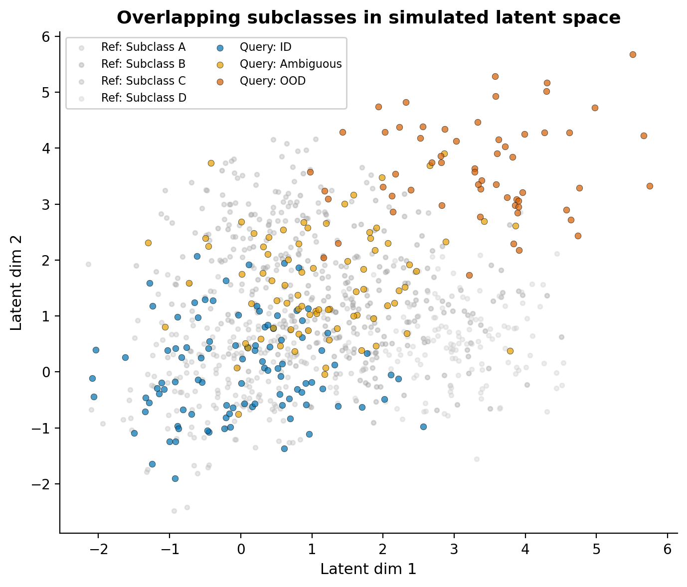
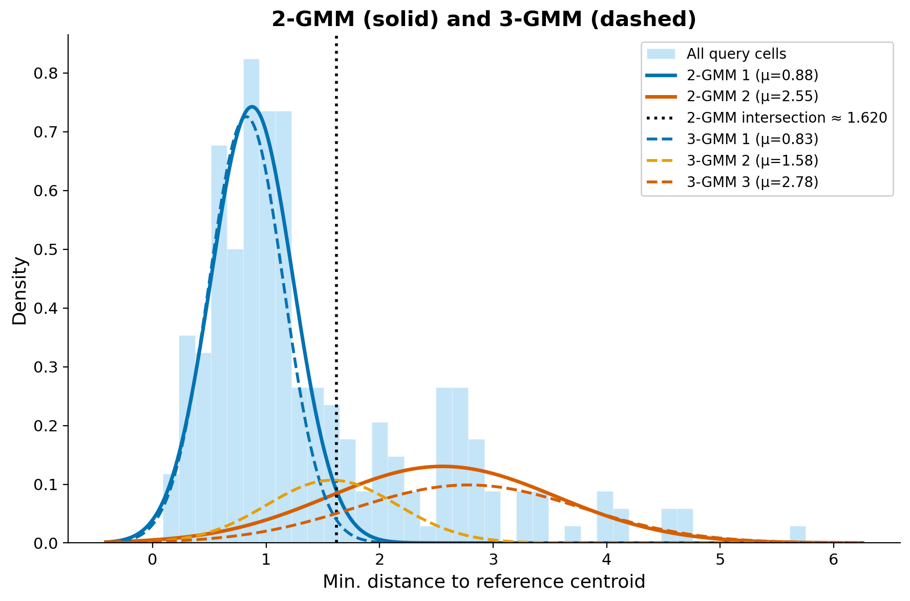
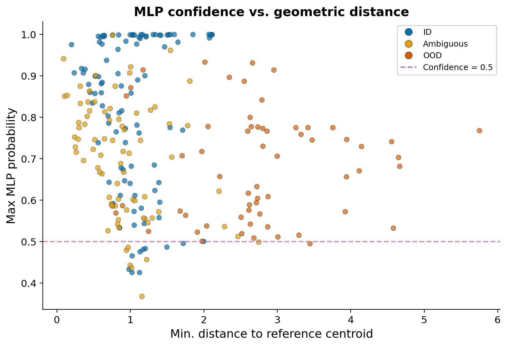
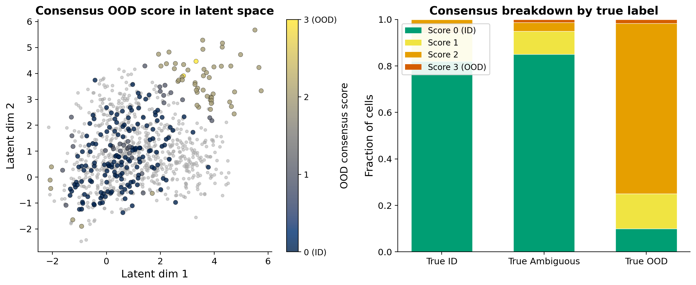
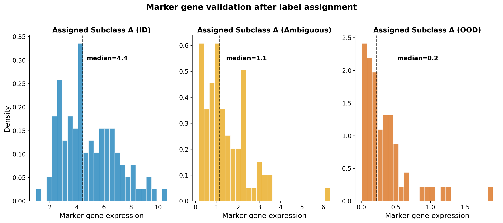

In cross-species single-cell workflows, we often transfer cell type annotations from a well-characterized reference (e.g., human) onto a query species (e.g., mouse). The implicit assumption is that every query cell has a counterpart somewhere in the reference. But what happens when it doesn't?

This is the out-of-distribution (OOD) detection problem: identifying query cells that don't belong to any reference class, so we can flag them rather than force a label. Getting this right matters because the alternative is silent misannotation, which is easy to miss and hard to trace downstream.

Here, I walk through the key ideas using simulated distributions as a thought exercise. The goal is to build geometric intuition for when and why labels break down, without needing real single-cell data to follow along.

# Why standard integration methods fall short

Before getting into OOD detection, it is worth acknowledging why this problem exists in the first place. Popular integration and label transfer methods were not designed to handle the combination of cross-species divergence and technical confounders that real datasets present.

In my experience with mouse-human mapping, methods like **LIGER** (NMF-based) and **Seurat's label transfer** (CCA/anchor-based) struggled considerably when sequencing depth bias was deeply entangled with the biological signal. LIGER could achieve reasonable clustering and integration with parameter tuning, but was sensitive to technical effects and missed rare or ambiguous cell types. The key signals I cared about were lost when depth bias wasn't fully addressed. Downsampling prior to LIGER reduced the technical confounders but at the cost of significant biological signal loss, making it very difficult to detect meaningful structure in my data. Seurat's approach ran into similar limitations; anchor-based transfer assumes a degree of shared structure that breaks down when confounders dominate.

**scVI** and **MultiVI** performed better for embedding because they can explicitly model batch, species, and depth variability as covariates. However, while the embeddings were more reliable, they still don't solve the problem of ambiguous or outlier cell assignments. **scANVI** leverages reference labels for crisp assignments, but this is a double-edged sword: it forces ambiguous or novel cells into reference classes, producing overconfident and potentially misleading calls where true outliers remain hidden.

This is what motivated me to look beyond label transfer methods and toward geometry-based OOD detection.

# The reality of subclass boundaries

A common misconception is that cell type subclasses sit in neat, well-separated clusters in latent space. In practice, the picture is much messier. Subclasses within a cell type family (e.g., subtypes of T cells or inhibitory neurons) tend to form overlapping, continuous distributions. The boundaries between them are often arbitrary labels we impose for our own understanding, not sharp transcriptomic distinctions.

To reflect this, I simulate reference subclasses as overlapping Gaussian clusters with shared density regions, and query cells that range from clearly matching, or in-distribution (ID), to ambiguous, to sitting in the tail of the distribution with no clean reference match (OOD).

The reference subclasses (grey) overlap substantially, much like real within-family variation. Query cells include those that sit comfortably within a reference subclass (blue), those in the overlapping zone between subclasses (gold), and a population in the periphery without a clean match (dark orange). Importantly, the OOD cells are not on a separate island; they bleed into the ambiguous zone, just as they do in real data where the distance distribution is one continuous spread rather than discrete peaks.

# Distance-based OOD detection

The simplest geometric approach is to compute, for each query cell, the minimum distance to any reference subclass centroid. Cells far from all centroids are OOD candidates. I find this useful precisely because it is agnostic to classifier decisions and directly measures how well a cell fits *any* known reference state without forcing an assignment.

The distribution of these minimum distances usually reveals structure: a bulk of well-mapped cells at low distances, a tail of OOD cells at high distances, and often a shoulder of ambiguous cells in between. The challenge is that these populations overlap heavily; they form a continuous distribution, not discrete peaks.

# Why 2-component GMMs aren't enough

A natural next step is to model the distance distribution with a Gaussian Mixture Model (GMM) to automatically separate ID from OOD. Fitting a 2-component GMM assumes a simple "mapped + tail" structure, but that is almost never the whole story. There is frequently a **shoulder** of intermediate density: cells that partially overlap with reference subclasses but don't cleanly belong to any of them.

Overlaying both the 2-GMM (solid) and 3-GMM (dashed) on the same distance distribution makes the difference clear. The 2-GMM captures the bulk and the tail, but the intersection point it provides is a blunt threshold that lumps ambiguous cells in with either the mapped or unmapped group. The 3-GMM reveals a third component that captures this intermediate population, mapping to categories that make biological sense:

- **Core ID** (low mean): well-mapped cells with strong reference correspondence
- **Ambiguous** (intermediate mean): cells in the grey zone that partially match one or more subclasses
- **OOD** (high mean): cells with no reference counterpart

Whether 3 components are enough depends on the data. I use AIC/BIC and the visual shape of the density to guide this; in complex cross-species scenarios, more components may be justified.

# Classifier confidence is not a reliable OOD filter

My initial approach was to use an MLP classifier's confidence scores to filter out poorly mapped cells. The idea seemed straightforward: cells with low max probability should be OOD candidates. In practice, I found that even the lowest confidence scores for clearly unmapped cells hovered around 0.5 rather than dropping to near zero. The MLP just isn't uncertain enough about anything.

This plot captures the problem. Even OOD cells (dark orange) at high geometric distances maintain max probabilities in the 0.4-0.6 range. The MLP partitions the entire feature space into decision regions, so every point *must* land in some class, and the softmax output rarely drops low enough to be a useful OOD signal. For subclass-level distinctions where boundaries are already fuzzy, this means the classifier will assign a label where the honest answer is "we don't have full confidence in this subclass assignment."

I treat classifier-based confidence as supporting evidence, not as a reliable OOD filter on its own.

# Consensus across methods

The most reliable OOD calls come from agreement across multiple approaches. For each cell, I flag it as OOD by: (1) assignment to the high-distance component in the 3-GMM, (2) assignment to the tail in the 2-GMM, and (3) low MLP confidence below a threshold.

Cells with a consensus score of 0 are robust ID calls. Cells where all methods agree on OOD are high-confidence novel or species-specific states. Everything in between is the ambiguous middle ground. Rather than trying to resolve these computationally, I think the more honest approach is to flag them and say: this cell does not map confidently, and here is the evidence for why.

# Assignment is only the first step

A consensus OOD call, or even a confident classifier label, is not the end of the story. Every label assignment needs to be validated against known marker genes or features for the assigned subclass. This is especially critical in cross-species mapping where marker conservation is not guaranteed.

Consider cells that a classifier assigns as "Subclass A." For true ID cells (blue), expression of the canonical marker is high and tightly distributed. For ambiguous cells (gold), expression is moderate and dispersed, reflecting partial or uncertain identity. For OOD cells (dark orange), expression is near zero despite the confident label.

This is why marker validation is non-negotiable:

- **Cells assigned as OOD but retaining marker expression** may be batch or dataset artefacts, or rare biology that the geometric methods missed. These deserve closer inspection rather than blanket exclusion.
- **Cells assigned as ID but lacking expected markers** could be false positives, or species-specific states where the homologous marker has diverged or is not expressed at comparable levels.
- **Species-specific marker differences** need to be accounted for. A marker that is canonical in human may be lowly expressed or absent in mouse for the same cell type. Relying on a single marker without considering orthologous expression patterns will mislead you.

In practice, I use a panel of markers per subclass, cross-referenced against known species-specific expression differences, and interpreted alongside the geometric OOD evidence.

# The ambiguous population is informative

It is tempting to treat ambiguity as a failure of the method, but I have found the ambiguous population is often the most interesting:

- **Evolutionary divergence**: ambiguous cells may represent species-specific cell states or transitional populations without a clean one-to-one reference match.
- **Reference quality**: low GMM means in a subclass indicate well-conserved, cleanly mapped states. High or spread-out means suggest mapping uncertainty. Very high OOD means indicate states that are simply missing from the reference.
- **Technical artefacts**: ambiguous clusters often correlate with reference "catch-all" categories, technical doublets, underrepresented populations, or true biological intermediates.

Given the continuous nature of transcriptomic variation within cell type families, many of these ambiguous cells are not errors. They are edge cases that this approach can at least point out honestly, rather than sweep under a confident label.

# Takeaways

These are the practical lessons I have taken away from working through this problem:

1. **Standard methods struggle with confounders.** LIGER, Seurat, and even scANVI can produce overconfident assignments when technical effects like sequencing depth are deeply entangled with biological signal. Know the limitations of your integration method before trusting its labels.
2. **Latent space quality first.** Everything downstream depends on the embedding. Prioritize integration quality (scVI/MultiVI with proper covariates) over classifier sophistication.
3. **Use 3+ component GMMs** to capture the ambiguous middle ground rather than forcing a binary ID/OOD split. Let AIC/BIC and the density shape guide the choice.
4. **Don't rely on classifier confidence for OOD.** In my experience, MLPs assign labels with surprisingly high confidence to everything, including clear outliers. Even the "least confident" OOD calls tended to sit around 0.4-0.5, not near zero, which made it impractical to use confidence scores alone as a filter.
5. **Build consensus** across geometric, statistical, and classifier-based methods for the most robust calls.
6. **Always validate with markers.** Assignment is only the first step. Use a panel of canonical markers, interpreted with awareness of species-specific differences, alongside the geometric evidence.
7. **Flag uncertainty, don't hide it.** It is better to say "we do not have full confidence in this subclass label" than to assign a high-confidence label that downstream analyses will take at face value.
